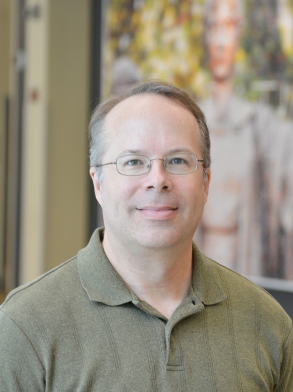
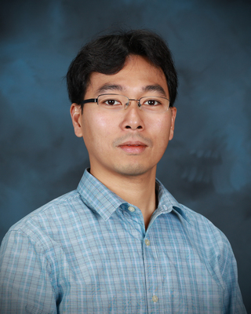

# SC19 Birds of a Feather
## HPC System Testing: Procedures, Acceptance, Regression Testing, and Automation
### Description

This Birds of a Feather (BOF) session will briefly highlight acceptance and
regression testing procedures at several large-scale HPC centers. The goal of
this BOF is to bring together testing efforts from multiple leadership-class
supercomputer centers and ideas from the HPC community to discuss the different
strategies used and to document lessons learned. 

BOF attendees will have the opportunity to share their experiences conducting
acceptance and regression testing at their institutions and exchange best
practices with other HPC centers.

### When & Where

- *Date:* Thursday, November 21, 2019 from 12:15pm to 1:15pm.
- *Location:* Room 607, Colorado Convention Center, Denver CO, USA.

### Speakers

#### Brett Bode (NCSA)

Brett M. Bode is an Assistant Director at National Center for Supercomputing Applications (NCSA) and a co-Principal Investigator on the Blue Waters project. Prior to the current operational role with Blue Waters, Brett was the lead of the Advanced Digital Services division at NCSA and managed the system software development projects for the Blue Waters project. Blue Waters is the premier HPC system in the National Science Foundation portfolio providing leading edge computing and data capabilities to scientists around the United States. Prior to joining NCSA in 2008, Brett spent nearly ten years as a scientist with the Department of Energy's Ames Laboratory at Iowa State University researching ways to deliver better performance to scientific applications from HPC cluster systems. Brett holds a BS in chemistry and physics from Illinois State University and a PhD in physical chemistry from Iowa State University.

#### Reuben Budiardja (ORNL)
 Reuben Budiardja is a computational scientist in the National Center for Computational Sciences at Oak Ridge National Laboratory. He earned his doctorate degree from the University of Tennessee in Knoxville, Tennessee in computational astrophysics. He has broad research interests ranging from the development of large-scale astrophysics simulation code to investigate the mechanism of core-collapse supernovae to developing system tools to understand application motifs, usage, and performance on supercomputers. Throughout his career, he has collaborated with application scientists from various disciplines helping them to achieve their scientific objectives by exploiting supercomputing capabilities.

#### Tina DeClerck (NERSC)

Tina Declerck leads the NERSC System's Department that is composed of the Computational Systems, Security and Networking, Operations Technology, and Building Infrastructure groups. Accomplishments include managing the configuration, installation, and acceptance of the NERSC-9 (Perlmutter) system--expected to arrive in early 2021, and project lead on NERSC-8 (Cori). Tina has experience on almost all of the systems installed at NERSC since 1996 as a system analyst since its move to Lawrence Berkeley National Lab from Livermore. Tina had a short hiatus from NERSC during which she focused on storage startups from 2001 – 2006. Prior to joining NERSC in 1997 she worked at The Liposome Company and was an officer in the USAF.

#### Bilel Hadri (KAUST)

Bilel Hadri is a Computational Scientist at the Supercomputing Core Lab at KAUST since July 2013. He contributes in benchmarking and performance optimization, helps in systems procurements, upgrades, and provides regular training to users. He received his Masters in Applied Mathematics and his PhD in Computer Science from the University of Houston in 2008. He joined the National Institute for Computational Science at Oak Ridge National Laboratory as a computational scientist in December 2009 following a Postdoctoral Position in June 2008 at the University of Tennessee Innovative Computing Laboratory led by Dr. Jack Dongarra. His expertise areas include performance analysis, tuning and optimization, System Utilization Analysis, Monitoring and Library Tracking Usage, Porting and Optimizing Scientific Applications on Accelerator Architectures (NVIDIA GPUs, Intel Xeon Phi), Linear Algebra, Numerical Analysis and Multicore Algorithms.

#### Verónica G. Melesse Vergara (ORNL)

Verónica G. Melesse Vergara is originally from Quito, Ecuador. Verónica earned a B.A. in Mathematics/Physics at Reed College and a M.S. in Computational Science at Florida State University. Verónica has eight years of experience in the high performance computing field and is currently working as an HPC Engineer at the Oak Ridge Leadership Computing Facility. In addition to providing assistance to OLCF users, Verónica is part of the systems testing team, led acceptance for Summit, and leads acceptance testing for Frontier, ORNL's exascale supercomputer to be deployed in 2021. Her research interests include high performance computing, large-scale system testing, and performance evaluation and optimization of scientific applications. Verónica is a member of both IEEE and ACM and serves in the ACM SIGHPC Executive Committee.

#### Celso Mendes (NCSA)

Celso L. Mendes has been working with high-performance computing for more than twenty-five years. He has been a research scientist with the Pablo research group and with the Parallel Programming Lab, both at the University of Illinois at Urbana-Champaign, conducting research on performance analysis of large parallel systems. As a senior staff member of NCSA's Blue Waters project, which he  joined since the early pre-proposal phase, he was the coordinator for acceptance testing of the sustained-petascale Blue Waters system. Celso obtained the degrees of Electronics Engineer and Master in Electronics Engineering, at ITA/Brazil, and of Ph.D. in compuer science from the University of Illinois, having developed his thesis research on performance prediction for multicomputers. He is a member of the ACM and of the Brazilian Computer Society.

### Schedule

* Audience Live Survey:
  * Are you aware of any acceptance or regression testing tools/frameworks? 
  * Does your HPC center perform a formal acceptance test? 
  * Does your HPC center perform regression testing? 
  * What tests are performed?
  * Is it an automated process? 
  * How long does it last?

* Lightning talks: 5 minutes each
  * KAUST: Bilel Hadri
  * NCSA: Brett Bode & Celso Medes
  * NERSC: Tina Declerck
  * OLCF: Verónica G. Melesse Vergara 
  
* Open Forum:
  * CSCS: Vasileios Karakasis
  * IU: Scott Michael
  * Everyone welcome to present!
  
* Q & A

* Wrap-up
