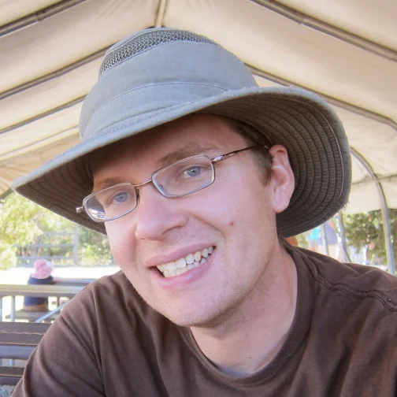
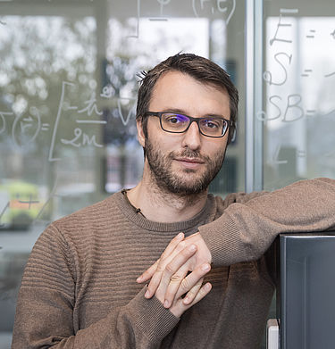

# SC21 Conference Birds-of-a-Feather (BOF)

## HPC System Test: Towards Improving Availability and Portability of HPC Test Suites

### BOF Session Description

This session will build upon the knowledge we have gathered from centers including the IT Center for Science in Finland (CSC), Swiss National Supercomputing Centre (CSCS), Indiana University (IU), King Abdullah University of Science & Technology (KAUST), National Center for Supercomputing Applications (NCSA), National Energy Research Scientific Computing center (NERSC), Oak Ridge National Laboratory (ORNL), Los Alamos National Laboratory (LANL), and Lawrence Livermore National Laboratory (LLNL). From previous collaborations, we have learned that individual centers have specific sets of tools, both in-house developed and open source, that are used to launch and monitor tests during acceptance and regression testing. For example, KAUST and CSCS rely on ReFrame for regression testing, whereas ORNL, LANL, and LLNL use in-house developed tools that are now open source. The information collected about the tools featured can be found at: [https://olcf.github.io/hpc-system-test-wg/](https://olcf.github.io/hpc-system-test-wg/).

On the other hand, we also learned that there is significant overlap in the tests developed and executed at each center. With this fourth iteration of the HPC System Test BOF we aim to gain a better understanding of the tests available at each participating center and determine how we can leverage community efforts to augment and improve tests suites.  

Prior to the session, we will invite members of the newly formed HPC System Test working group to sign-up for lightning talks to share information about their current testing suites and their availability. During the session, we will first share a roadmap of the current state of test availability at four different HPC centers: LANL, KAUST, CSCS, and ORNL, followed by a working discussion on how to best distribute, utilize, and contribute to these test suites. Attendees will be invited to consider the following questions:

- Can we design a common template that can capture the information you would need to port a test to your system/facility?
- What are the top 3 areas at your center that currently have good test coverage? 
- What are the top 3 areas at your center that do not currently have good test coverage?
- How do you envision adapting testing at your center to support new types of non-traditional HPC workloads (e.g., containerized applications, dynamic cloud-like HPC environments)?
- Does your center currently support workloads on specialized hardware (e.g., FPGA, AI specialized HW)? If yes, what testing procedures do you use?

The material and discussions in the session will be beneficial to both users, system administrators, and center staff at research computing, industry, and academic institutions from small to leadership-class scales.

### When & Where

- *Date:* Tuesday, 16 November, 2021 from 5:15pm - 6:45pm CST
- *Event:* [https://sc21.supercomputing.org/presentation/?id=bof136&sess=sess381](https://sc21.supercomputing.org/presentation/?id=bof136&sess=sess381)
- *Location:* Virtual via SC21 HUBB (link TBA)

### Agenda 

- Audience Survey on Slido
- Lightning talks  on “Test Suites Content and Availability”
  - First half will be presented by the session leaders representing 4 different institutions
  - Invited Lightning Talks
- Open Q&A with presenters
- Working session to discuss development of a common template
- Defining Next Steps

### Session leaders
- Bilel Hadri (King Abdullah University of Science and Technology)
- Francine Lapid (Los Alamos National Laboratory)
- Paul Ferrell (Los Alamos National Laboratory)
- Vasileios Karakasis (Swiss National Supercomputing Centre)
- Verónica G. Melesse Vergara (Oak Ridge National Laboratory) 

### Speakers

#### Bilel Hadri (KAUST)

Bilel Hadri is a Computational Scientist at the Supercomputing Core Lab at KAUST since July 2013. He contributes in benchmarking and performance optimization, helps in systems procurements, upgrades, and provides regular training to users. He received his Masters in Applied Mathematics and his PhD in Computer Science from the University of Houston in 2008. He joined the National Institute for Computational Science at Oak Ridge National Laboratory as a computational scientist in December 2009 following a Postdoctoral Position in June 2008 at the University of Tennessee Innovative Computing Laboratory led by Dr. Jack Dongarra. His expertise areas include performance analysis, tuning and optimization, System Utilization Analysis, Monitoring and Library Tracking Usage, Porting and Optimizing Scientific Applications on Accelerator Architectures (NVIDIA GPUs, Intel Xeon Phi), Linear Algebra, Numerical Analysis and Multicore Algorithms.

#### Caspar van Leeuwen (SURF)

#### Francine Lapid (LANL)

Francine Lapid is a Computer Scientist in the High Performance Computing Division in Los Alamos National Laboratory. She started working for the Programming and Runtime Environments team after graduating with a Bachelor of Science in Computer Engineering from Texas A&M University in 2019. Francine is also one of the contributors to Pavilion 2, a Python 3-based testing framework used to facilitate benchmarking HPC clusters. 

#### Paul Ferrell (LANL)

Paul Ferrell is a Computer Scientist at Los Alamos National Laboratory with over 15 years of experience in software development, cyber security, and HPC platforms. He is the lead developer on Pavilion 2.0, a flexible Python and YAML based framework for testing HPC clusters. He has a MS in Computer Science from New Mexico Tech.

#### Vasileios Karakasis (CSCS)

Since November 2018, Vasileios has been leading the Scientific Computing Support Group after working for three years as an HPC Application Specialist in the same group. As group lead, Vasileios manages the activities of the team to enable the CSCS user community to make the best use of the HPC environment that CSCS is providing. Vasileios specializes in performance engineering and regression testing. He has mentored teams in GPU Hackathons organized by the center and acted as the lead developer of a framework for regression testing and continuous integration of HPC applications. Furthermore, he is involved in directive-based GPU programming, representing the center in the OpenACC technical committee. Vasileios received a Ph.D. in high performance computing from the National Technical University of Athens.

#### Verónica G. Melesse Vergara (ORNL)

Verónica G. Melesse Vergara is originally from Quito, Ecuador. Verónica earned a B.A. in Mathematics/Physics at Reed College and a M.S. in Computational Science at Florida State University. Verónica has eight years of experience in the high performance computing field and is currently working as an HPC Engineer at the Oak Ridge Leadership Computing Facility. In addition to providing assistance to OLCF users, Verónica is part of the systems testing team, led acceptance for Summit, and leads acceptance testing for Frontier, ORNL's exascale supercomputer to be deployed in 2021. Her research interests include high performance computing, large-scale system testing, and performance evaluation and optimization of scientific applications. Verónica is a member of both IEEE and ACM and serves in the ACM SIGHPC Executive Committee.

