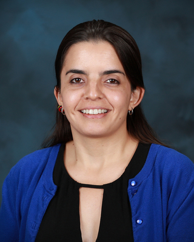

# SC22 Birds of a Feather
## HPC System Testing:  Looking ahead to Post-Exascale Systems and HPC Ecosystems
### Description

This BoF brings together experts from HPC centers around the globe to discuss 
future system testing methodologies. The session will include a panel focusing
on HPC system testing at scale including acceptance testing of Perlmutter, Frontier, 
Fugaku, and LUMI. Panelists will describe challenges faced and share their 
perspectives on how those could have been overcome. Then, we will host two speakers
to spark ideas for the open discussion in which attendees will be invited to 
identify key areas that HPC center staff and vendors should focus on to prepare
for the next-generation of compute and data resources.

BOF attendees will have the opportunity to share their experiences conducting
acceptance and regression testing at their institutions and exchange best
practices with other HPC centers.

### When & Where

- *Date:* Wednesday, November 16th, 2022 from	5:15pm-6:45pm.
- *Location:* Room D173, Kay Bailey Hutchison Convention Center, Dallas, TX, USA.

### Moderators

#### Verónica G. Melesse Vergara (ORNL)

Verónica G. Melesse Vergara is originally from Quito, Ecuador. Verónica earned a B.A. in Mathematics/Physics at Reed College and a M.S. in Computational Science at Florida State University. Verónica has eight years of experience in the high performance computing field and is currently working as an HPC Engineer at the Oak Ridge Leadership Computing Facility. In addition to providing assistance to OLCF users, Verónica is part of the systems testing team, led acceptance for Summit, and leads acceptance testing for Frontier, ORNL's exascale supercomputer to be deployed in 2021. Her research interests include high performance computing, large-scale system testing, and performance evaluation and optimization of scientific applications. Verónica is a member of both IEEE and ACM and serves in the ACM SIGHPC Executive Committee.

#### Bilel Hadri (KAUST)

Bilel Hadri is a Computational Scientist at the Supercomputing Core Lab at KAUST since July 2013. He contributes in benchmarking and performance optimization, helps in systems procurements, upgrades, and provides regular training to users. He received his Masters in Applied Mathematics and his PhD in Computer Science from the University of Houston in 2008. He joined the National Institute for Computational Science at Oak Ridge National Laboratory as a computational scientist in December 2009 following a Postdoctoral Position in June 2008 at the University of Tennessee Innovative Computing Laboratory led by Dr. Jack Dongarra. His expertise areas include performance analysis, tuning and optimization, System Utilization Analysis, Monitoring and Library Tracking Usage, Porting and Optimizing Scientific Applications on Accelerator Architectures (NVIDIA GPUs, Intel Xeon Phi), Linear Algebra, Numerical Analysis and Multicore Algorithms.

### Speakers

#### Zach Tschirhart (HPE)

#### Maria Del Carmen Ruiz Varela (AMD)

#### Danny Bolding (AMD)

#### Jens Domke (RIKEN)

#### Matt Davis (ORNL)

#### Ugo Varetto (Pawsey Supercomputer Research Center)

### Schedule

- 17:15 - 17:20 Welcome: 
  - Bilel Hadri, KAUST 
  - Verónica G. Melesse Vergara, ORNL
- 17:20 - 17:25 Interactive Survey
- 17:25 - 17:45 Invited Mini-talk: Jens Domke, RIKEN
- 17:45 - 18:05 Invited Mini-talk: Zach Tschirhart, HPE
- 18:05 - 18:25 Open panel discussion:
  - **Moderators**: Bilel Hadri and Verónica G. Melesse Vergara
  - **Panelists**:
  - Danny Bolding, AMD
  - Matt Davis, ORNL
  - Jens Domke, RIKEN
  - María del Carmen Ruiz Varela, AMD
  - Zach Tschirhart, HPE
  - Ugo Varetto, Pawsey Supercomputer Research Centre

- 18:25 - 18:35 Collaboration Opportunities
- 18:35 - 18:45 Closing remarks
      
### Connect with the HPC System Test Community
To join the HPC System Test working group Slack, please visit:
http://tinyurl.com/hpcsystemtest-slack

